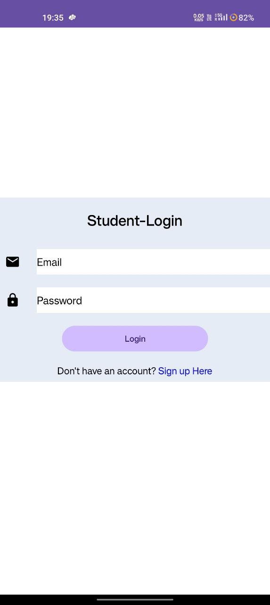
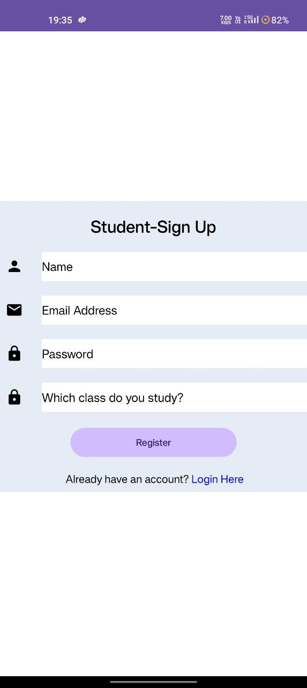
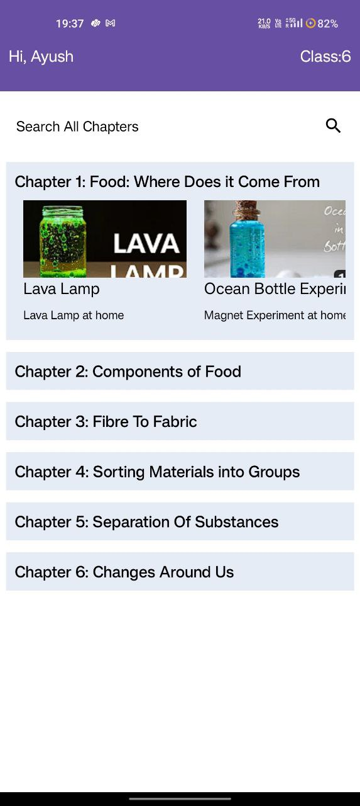
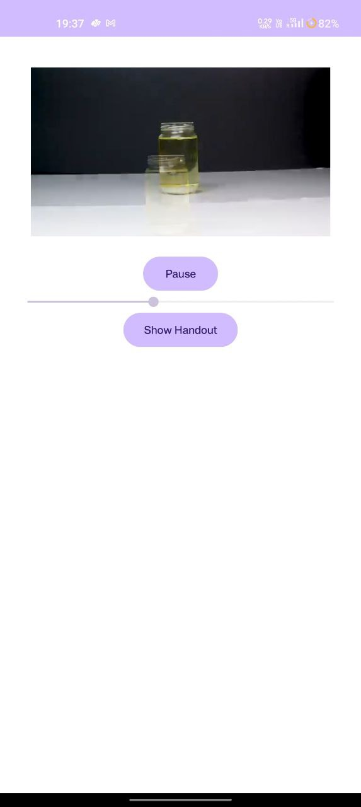
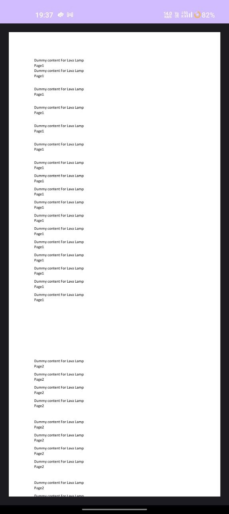

# Assignment README

## Introduction

This Android application is designed to fulfill the requirements of the assigned task. It includes features like user authentication, class selection, chapter viewing, experiment listing, video playback and handout access.

## Features

- **User Authentication**: Users can create an account with their Name, Email, Password, and select their studying class (6 to 10).

- **Chapter Selection**: After signing up, users are presented with a list of chapters from their respective Science books based on their selected class.

- **Chapter View**: Chapters are displayed using a RecyclerView.

- **Experiment Listing**: Clicking on a chapter reveals a horizontal RecyclerView displaying a list of experiments related to that chapter.

- **Video Playback**: The experiments include videos downloaded from YouTube. Clicking on a video navigates the user to a new activity to watch the video.

- **Handout Access**: Below each video, there is a "Show Handout" button. Clicking this button opens a PDF document using AndroidPdfViewer library.

## Screenshots

*Login Page*

*Register Page*

*RecyclerView Page*

*Video View Page*

*Handout Page*

## Screen Recording

[Click here to watch the screen recording](images/output_screen.mp4)

## Setup

To run this application, follow these steps:

1. Clone the repository.
2. Open the project in Android Studio.
3. Build and run the application on an Android device or emulator.

## Libraries Used

- AndroidPdfViewer: [Link to library](https://github.com/barteksc/AndroidPdfViewer)

## Notes

- Dummy data has been used for demonstration purposes.
- The videos and PDFs used in this project are placeholders.

## Acknowledgements

- Special thanks to [AndroidPdfViewer](https://github.com/barteksc/AndroidPdfViewer) for providing a convenient way to view PDF documents in Android applications.

Feel free to reach out if you have any questions or need further assistance. Happy coding!
